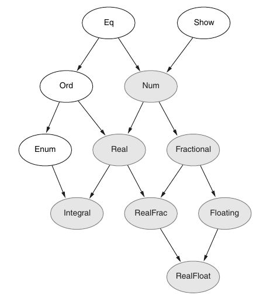
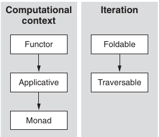
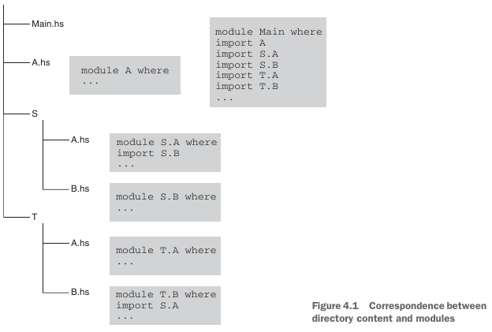

- Format `CSV` files on the command line:
  ```shell
  $ cabal install tablize
  $ tablize tt.csv
  ```

- Page 17:
  - Use `Text` type for processing textual information instead of `String`.
  - Enable the `OverloadedStrings` extension to make it more convenient to use string literals as `Text` values.
    - [Overloaded string literals](https://ghc.gitlab.haskell.org/ghc/doc/users_guide/exts/overloaded_strings.html)
    - Uses `IsString` type class to convert a `String` to target type (in this caes `Text`).
    - The extension `OverloadedStrings` replaces every string literal in the source code with a call `fromString`.
  - Use favorite package for representing data in text: `formatting` and `fmt` are good candidates.

- Page 19:
  - _"An experienced Haskeller often looks for a type class first and then starts coding."_

- Page 22:
  - Get info from `GHCi`:
    ```shell
    ghci> :info Eq
    ghci> :doc Eq
    ```
- Page 27:
  - When encountering a new data type, it is always a good idea to look for provided instances.
  ```shell
  ghci> :info Text
  instance Monoid Text -- Defined in 'Data.Text'
  instance Semigroup Text -- Defined in 'Data.Text'
  ```

- Page 28:
  - Enabling and disabling GHC extensions in GHCi
    - Source Code:
      ```haskell
      {-# LANGUAGE OverloadedStrings #-}
      ````
    - GHCi:
      ```haskell
      ghci> :set -XOverloadedStrings
      ghci> :set -XNoOverloadedStrings
      ```
- Page 32:
  ```haskell
  rotateFromFile ∷ Direction → FilePath → IO ()
  rotateFromFile dir fname = do
    f ← readFile fname
    let turns = map read $ lines f
        finalDir = rotateMany dir turns
        dirs = rotateManySteps dir turns
    fmtLn $ "Final direction: " +|| finalDir ||+ "" -- using Show instance of Direction (for 'finalDir') !!!
    fmt $ nameF "Intermediate directions" (unwordsF dirs) -- using Buildable instance of Direction (for 'dirs') !!!
  ```
  - We don't use `putStr` or a similar function: the `fmt` function is clever enough to print the given value in the context, where `IO ()` is expected.
  - This is also implemented with type classes and instances.
  - The `fmt` result has the type `FromBuilder b ⇒ b`.
  - The `IO ()` instance of `FromBuilder` prints the given value.
  - The `FromBuilder` type class also has an instance for `Text`, so it can be used to return a `Text` value as well.

- Page 32: **Polymorphic Values**
  - The values of the `C a ⇒ a` type are called polymorphic, because they can be used in many forms, depending on the required type.
  - For example, we can use numeric values polymorphically without specifying a type, such as `Num a ⇒ a`.
  - `String` literals become polymorphic `IsString s ⇒ s` if we enable the `OverloadedStrings` GHC extension.
  - The `FromBuilder b ⇒ b` type follows the same idea.

- [List of all Extensions](https://downloads.haskell.org/~ghc/9.0.1/docs/html/users_guide/exts/table.html)
- Used extensions in Chapter 2:
  - [DeriveAnyClass](https://downloads.haskell.org/~ghc/9.0.1/docs/html/users_guide/exts/derive_any_class.html)
  - [OverloadedStrings](https://downloads.haskell.org/~ghc/9.0.1/docs/html/users_guide/exts/overloaded_strings.html)
  - [StandaloneDeriving](https://downloads.haskell.org/~ghc/9.0.1/docs/html/users_guide/exts/standalone_deriving.html)
  - [UnicodeSyntax](https://downloads.haskell.org/~ghc/9.0.1/docs/html/users_guide/exts/unicode_syntax.html)
    - nvim shorthand `<leader>sh` for unicode support (sh = substitute Haskell)
- [Ormolu Magic Comments](https://github.com/tweag/ormolu#magic-comments): `{- ORMOLU_ENABLE -}`, `{- ORMOLU_DISABLE -}`

- `error` can be used anywhere as the output is any type:
  ```haskell
  error ∷ ∀ a. HasCallStack ⇒ [Char] → a
  ```

- Trick: Import type explicitly so you don't need to qualify it in signatures.
  ```haskell
  import Data.Text (Text)             -- little trick
  import qualified Data.Text as T

  extractVocab ∷ Text → Vocabulary    -- instead of:
  extractVocab ∷ T.Text → Vocabulary
  ```

- Page 35: **Random Generators & Testing**
  - Creating a random `a` in a monadic context with `getStdRandom uniform`, e.g. in IO:
    ```haskell
    randomA ∷ Uniform a ⇒ IO a
    randomA = getStdRandom uniform
    -- many as:
    randomAs ∷ Uniform a ⇒ Int → IO [a]
    randomAs n = replicateM n randomA
    -- fix a type to generate specific random values, e.g. `Turns`:
    randomTurns ∷ Int → IO [Turn]
    randomTurns = uniformsIO
    ```
  - One also needs to implement a `Uniform` instance which is easy to implement with a `UniformRange` instance.
  - Just leverage existing instances for `Int`.
    ```haskell
    instance UniformRange Turn where
      uniformRM (lo, hi) = toEnum <$> uniformRM (fromEnum lo, fromEnum hi)
    instance Uniform Turn where
      uniformM = uniformRM (minBound, maxBound)
    ```

- Page 39:
  - Hierarchy of numeric type classes:
  - 
  - `Word`s are strictly positive!
  - `Int`s are positive and negative.
    ```shell
    ghci> (minBound, maxBound) ∷ (Word, Word)
    (0,18446744073709551615)
    ghci> (minBound, maxBound) ∷ (Int, Int)
    (-9223372036854775808,9223372036854775807)
    ```
  - One problem with this type is that the argument now can be `Complex a`, but the radius cannot be a complex number - it must be real.
    ```haskell
    circleArea ∷ Floating a ⇒ a → a
    circleArea r = pi * r * r
    ```
  - realToFrac ∷ (Real a, Fractional b) ⇒ a → b
    - `Floating` extends `Fractional` ⇒ we can use it to get a value of any type `b` with the `Floating` instance
      ```haskell
      circleArea ∷ (Real a, Floating b) ⇒ a → b
      circleArea r = pi * realToFrac (r * r)
      ```
  - fromIntegral ∷ (Integral a, Num b) ⇒ a → b
    ```haskell
    xs ∷ [Int]
    xs = [1,2,3,4,5]
    ```
    ```shell
    ghci> sum xs / fromIntegral (length xs)
    3.0
    ```

- Page 42:
  - Fixed Precision
    ```shell
    ghci> import Data.Fixed
    ghci> 3.141592653589793 ∷ Deci
    3.1
    ghci> 3.141592653589793 ∷ Centi
    3.14
    ghci> 3.141592653589793 ∷ Milli
    3.141
    ghci> 3.141592653589793 ∷ Micro
    3.141592
    ghci> 3.141592653589793 ∷ Nano
    3.141592653
    ghci> 3.141592653589793 ∷ Pico
    3.141592653589
    ```
  - Define own resolution:
    ```haskell
    instance HasResolution E4 where
      resolution _ = 10000
    type Fixed4 = Fixed E4
    ```
    ```shell
    ghci> 3.141592653589793 ∷ Fixed4
    3.1415
    ```

- Page 46:
  - The best advice on `Show` and `Read` is to avoid implementing them manually.
  - Derived `Show` and `Read` instances may still be used for simple cases when debugging or exploring code in `GHCi`.
    - `show` and `read` are inverse operations: read (show a) == a; show (read a) == a
  - But it is always better to use some formatting (for `Show`) or a parsing library (for `Read`) instead.
  - `String` is very inefficient and should never be used in production code. Use `Text` instead!

- Page 47:
  - `TextShow` supports converting recursive data types to `Text` with parentheses, depending on precedence!

- Page 51:
  - 

- Page 77:
  - `FromField (..)` in the import list for the `Data.Csv` module refers to the `FromField` type class and **every method** of this type class.
    ```haskell
    import Data.Csv (FromField (..), FromNamedRecord)
    ```

- Page 82:
  - Nice application of [unzip3](https://hackage.haskell.org/package/base-4.16.3.0/docs/Prelude.html#v:unzip3):
    ```haskell
    (candles, closings, volumes) = unzip3 $
      [ (Candle day low open 0 close high,
        (day, close),
        (day, [volume])) | QuoteData {..} ← toList quotes ]
    ```

- Page 99: Chapter 4
  - Special package, `base`, contains the definitions from the standard library (as defined by the Haskell 2010 Language Report) together with GHC-specific additions.
  - Import the whole module, `import Data.List`
  - Import only specific names from the module by listing them in parentheses after the module name, `import Data.Char (toLower, toUpper)`
  - Import no names at all with an empty list of names (note that this IMPORTS ALL THE INSTANCES because they have no names in Haskell), `import Data.Char ()`
  - Import names with optional or mandatory qualification with an alias (`as`) or a full module name to avoid name clashes, `import qualified MyModuleWithAVeryLongModuleName as Shorty`,  `import qualified MyModule`
  - Import all names except those listed after the hiding keyword. `import Data.Char hiding (toLower, toUpper)`

  - Exports:
    ```haskell
    module ModuleName (
      module X,                 -- reexports everything from module X
      DataType1,                -- only the type constructor is exported.
      DataType2 (..),           -- exports the type constructor with all data constructors
      DataType3 (Cons1, Cons2), -- exports the type constructor with the two mentioned data constructors
      TypeClass1,
      TypeClass2 (..),
      TypeClass3 (method1, method2),
      fun1, fun2, fun3
    ) where
    ...
    ```
  - Remember also that instances of type classes are always exported.
  - The module name can be hierarchical, with components separated by dots (e.g., Graphics.Rendering.Chart.Backend.Cairo). The Haskell Report does not set out a meaning for this hierarchy, ALTHOUGH EXISTING IMPLEMENTATIONS normally use it as an instruction for finding module source code files in subdirectories.
  - Note that a module is always imported by its full name, regardless of whether we import it from the same subdirectory (as in S.A) or a neighboring subdirectory (as in T.B ).
    
  - Whenever we write import in a program, we import a particular module but not the whole module subhierarchy. Hierarchical module names are about naming only, and we shouldn’t expect anything else.

  - Provide include/module root path with -i`path` (no spaces after flag):
    ```shell
    $ ghci B.hs -i..
    ```

  - Do not import standard `Prelude`:
    ```haskell
    -- do not import Prelude
    {-# LANGUAGE NoImplicitPrelude #-}
    ```

  - Custom preludes:
    - https://hackage.haskell.org/packages/#cat:Prelude
    - https://hackage.haskell.org/packages/search?terms=prelude
    - relude (most stars on Github and very active; from kowainik); integration with [Summoner](https://kowainik.github.io/projects/summoner).
    - foundation
    - protolude
    - classy-prelude
    - universum

  - `Setup.hs` is used for package distribution:
    ```shell
    # download and unpack package
    $ curl http://hackage.haskell.org/package/timeit-2.0/timeit-2.0.tar.gz \ --output timeit-2.0.tar.gz
    $ tar -xf timeit-2.0.tar.gz
    $ cd timeit-2.0
    # configure, build and install package manually (in real-world we'd use Cabal)
    $ runhaskell Setup.hs configure
    $ runhaskell Setup.hs build
    $ runhaskell Setup.hs install
    ```

  - GHC operates two package databases by default: the global one and a user-specific one, arranged in a stack with the user-specific database on top.
  - It starts searching for packages at the top of the stack and continues all the way to the bottom.
  - We can specify additional databases or compile our project against a completely different stack of package databases using the `GHC_PACKAGE_PATH` environment variable.

  - Besides using GHC package databases, we can maintain our own package databases.
  - We can create a package database for a specific project.
  - The packages we have there don't intervene with anything within a system.

    ```shell
    $ ghc-pkg --help
    $ ghc-pkg list
    $ ghc-pkg list --user
    $ ghc-pkg find-module '*time*'
    $ ghc-pkg describe time
    ```

  - No matter which project management tool is used, `Cabal` as a library is always used to manipulate Haskell packages.
  - Cooking a package out of the source files is called *cabalizing*.

    ```shell
    $ cabal init # starting point for new project
    $ cabal-bounds --help
    $ cabal-bounds format
    $ cabal-bounds update
    ```

  - Haskell Package Versioning Policy - PVP - https://pvp.haskell.org/
  - Version numbers: https://pvp.haskell.org/#version-numbers
  - base-4.11.0.1 → 4.11 is `major` version number, 0.1 is `minor` version number
  - Some people use semantic versioning: https://semver.org/
  - Author supports PVP.

  - Tip: Use hpack: https://github.com/sol/hpack

  - Cabal hell is history! But note: version of `base` package is linked to GHC version!
    ```shell
    ghcup tui  # see version of base package linked to ghc version!
    ```

  - Three approaches:
    - Curated sets of packages → `Stack`
    - Sandboxing → `old Cabal`
    - Persistent storage of uniquely identified package builds → `Nix`, `new Cabal` (>=1.24, default since 3.0)

  - Cabal keeps every once-required version of every package built against every once-required set of dependencies in a shared environment, at the cost of greater storage requirements.
  - Cabal always tries to get the newest versions available. If not wanted use `cabal freeze`.

  - Check of package would be accepted by Hackage:
    ```shell
    cabal check
    cabal sdist  # create package archive for Hackage
    ```
  - Check for outdated packages:
  - Use Hackage Dependency Monitor: https://packdeps.haskellers.com/
    ```shell
    cabal outdated  # but does not take current ghc version into consideration!
    ```

  - A package consisting of several packages is called a project and uses a `cabal.project` file, e.g. https://github.com/timbod7/haskell-chart/

  - `cabal.project.local` keeps special developer box settings, e.g.
    ```
    package gtk
      flags: +have-quartz-gtk
    ```

  - Many compiler options can be specified in `cabal.project`, either manually or by running the `cabal configure` command.

  - Use `cabal gen-bounds` to generate and test for version boundaries.

  - Besides `cabal init` for starting a new project you can use the [Summoner](https://kowainik.github.io/projects/summoner).

- Page 107: `Unfold`
  - Beautiful example for usage of Unfolds: [ch04/containers-mini/Bench.hs](https://github.com/mkohlhaas/Haskell-in-Depth/blob/main/ch04/containers-mini/Bench.hs)
  - [Anamorphisms aka Unfolds Explained](https://functional.works-hub.com/learn/number-anamorphisms-aka-unfolds-explained-50e1a)
  - Unfolds take an initial input, apply it to a function that returns a pair, and repeat the process to the second of the pair while joining the outputs in a list.
  ```haskell
  unfoldr ∷ (b → Maybe (a, b)) → b → [a]
  unfoldr (\x → if x > 9 then Nothing else Just (x, x + 1)) 0
  -→ [0,1,2,3,4,5,6,7,8,9]
  iterate f == unfoldr (\x → Just (x, f x))
  take 10 (iterate (*2) 1)
  -→ [1,2,4,8,16,32,64,128,256,512]
  ```
- Page 138: **Reader Monad**

    ```haskell
    class Monad m ⇒ MonadReader r m | m → r where
      reader ∷ (r → a) → m a        -- create reader
      ask ∷ m r                     -- get config
      local ∷ (r → r) → m a → m a   -- change config
    ```
  - `Reader` is not a monad, but `Reader r` is.
  - So the type of configuration should be uniquely determined by the type of a monad.
  - Captured by the `| m → r` part of the type class.
  - Given `m`, `r` must be unique.
  - If you have a multi-parameter type-class with arguments `a, b, c`, and `x`, this extension lets you express that the type `x` can be uniquely identified from `a`, `b`, and `c`:
    ```haskell
    class SomeClass a b c x | a b c → x where ...
    ```
  - When declaring an instance of such class, it will be checked against all other instances to make sure that the functional dependency holds, i.e. no other instance with same `a b c` but different `x` exists.
  - The `SomeClass` class can be thought of as a function of the arguments `a` `b` `c` that results in `x`. Such classes can be used to do computations in the typesystem.
  - You can specify multiple dependencies in a comma-separated list:
    ```haskell
    class OtherClass a b c d | a b → c d, a d → b where ...
    ```
  - Unlike the `RecordWildCards` GHC extension, `NamedFieldPuns` allows bringing into scope only the fields we are interested in.
    ```haskell
    {-# LANGUAGE NamedFieldPuns #-}

    doSomethingSpecial ∷ ConfigM ()
    doSomethingSpecial = do
      Config {verbose} ← ask -- uses `NamedFieldPuns` extension
      when verbose beVerbose
      ...
    ```
  - Helper functions:
    ```haskell
    -- runs a Reader
    runReader ∷ Reader r a → r → a
    -- modifies configuration but not its type, does not modify result
    local ∷ ∀ r (m ∷ * → *) a. MonadReader r m ⇒ (r → r) → m a → m a
    -- modifies result and its type but not configuration
    mapReader ∷ (a → b) → Reader r a → Reader r b
    -- modifies configuration and its type but not result
    withReader ∷ (r' → r) → Reader r a → Reader r' a
    ```
  - E.g. `local`:
    ```haskell
    silent ∷ Config → Config
    silent config = config {verbose = False}

    doSomethingSpecialSilently ∷ ConfigM ()
    doSomethingSpecialSilently = local silent doSomethingSpecial
    ```

- Page 140: **Writer Monad**
  ```haskell
  class (Monoid w, Monad m) ⇒ MonadWriter w m | m → w where
    writer ∷ (a, w) → m a      -- create a (Monad)Writer
    tell ∷ w → m ()            -- append value to log
    listen ∷ m a → m (a, w)    -- result will include log; extract log
    pass ∷ m (a, w → w) → m a  -- modify log; leave result alone
  ```

  - Helper functions:
  ```haskell
  listens ∷ MonadWriter w m ⇒ (w → b) → m a → m (a, b) -- uses `listen` and apply function (1st argument)
  censor ∷ MonadWriter w m ⇒ (w → w) → m a → m a       -- modify log; leave result alone (just uses `pass`)
  ```

  - Helper functions for running a Writer:
  ```haskell
  -- run a Writer; returns result and log
  runWriter ∷ Monoid w ⇒ Writer w a → (a, w)
  -- just return log; result is not interesting or trivial, e.g. ()
  execWriter ∷ Monoid w ⇒ Writer w a → w
  -- modify log and result and their types
  mapWriter ∷ (Monoid w1, Monoid w2) ⇒ ((a, w1) → (b, w2)) → Writer w1 a → Writer w2 b
  ```

- Page 143: **ViewPatterns GHC extension**
  - The ViewPatterns GHC extension allows calling a function on the argument first and then matching a result.
  ```haskell
  processLine ∷ (LineNumber, Text) → SQL
  processLine (_, T.splitOn ":" → [s1, s2]) = pure $ genInsert s1 s2  -- uses ViewPatterns extension
  processLine (i, s) = tell [WrongFormat i s] >> pure ""
  ```
- Page 146: **Curry**
  - Nice `curry` example:
  ```haskell
  gcdPrint ∷ (Show a, Integral a) ⇒ a → a → IO a
  gcdPrint = gcdM (curry print) -- `print` prints a tuple!
  ```

- Page 147: **Pointfree & Pointful**
- [Pointfree.io](http://pointfree.io/)
  ```shell
  cabal install pointfree pointful
  pointfree "gcdCountSteps x y = mapWriter (length <$>) (gcdLogSteps x y)"
  ⇒ gcdCountSteps = (mapWriter (length <$>) .) . gcdLogSteps
  pointful "gcdCountSteps = (mapWriter (length <$>) .) . gcdLogSteps"
  ⇒ gcdCountSteps e h = mapWriter (\ a → length <$> a) (gcdLogSteps e h)
  ```

- Page 147: **State Monad**
  -- Combines Reader and Writer functionalities.
  ```haskell
  class Monad m ⇒ MonadState s m | m → s where
    state ∷ (s → (a, s)) → m a  -- create a (Monad)State
    get ∷ m s                   -- get state (= ask from Reader)
    put ∷ s → m ()              -- put (new) state (= tell from Writer)
  ```

  - Helper functions:
  ```haskell
  modify ∷ MonadState s m ⇒ (s → s) → m ()  -- modify state
  gets ∷ MonadState s m ⇒ (s → a) → m a     -- get state and apply function (typically a record function) (= asks from Reader)
  ```
- Page 148:
  - Comparison of Reader, Writer and State monad:
  - All of them construct a computation in the corresponding Monad from its internal representation (a function, a pair, and a function returning a pair, respectively).
    ```haskell
    reader ∷ MonadReader r m ⇒ (r → a) → m a
    writer ∷ MonadWriter w m ⇒ (a, w) → m a
    state ∷ MonadState s m ⇒ (s → (a, s)) → m a
    ```
  - Helper functions:
    - Runners:
      ```haskell
      runState ∷ State s a → s → (a, s)                     -- returns result and state
      execState ∷ State s a → s → s                         -- returns only state
      evalState ∷ State s a → s → a                         -- returns only result
      ```
    - Modifiers:
      ```haskell
      mapState ∷ ((a, s) → (b, s)) → State s a → State s b  -- maps result and state
      withState ∷ (s → s) → State s a → State s a           -- changes state (= local from Reader - not withReader as type is not changed)
      ```

- Page 148: **Traverse**
  ```haskell
  addItem ∷ Integer → IntS () ⇒ traverse_ addItem ⇒ [Integer] → IntS ()
  ```

- Page 151:
  - Helpful GHCi command:
    ```shell
    :main [<arguments> ...]     # run the main function with the given arguments
    ```

- Page 151:
  - *"Haskell is the best imperative programming language in this part of the galaxy."*


- Page 157:
  - How to read this function:
    - m is a computation in the State monad
    - `whileNotEmptyAnd` a certain `predicate` holds, do `m`
    - Argument `m` can do whatever it wants with the `SYState`, and thanks to the monadic machinery, everything will be taken into account on the next iteration.
    ```haskell
    whileNotEmptyAnd ∷ (Token → Bool) → SYState () → SYState ()
    whileNotEmptyAnd predicate m = go
      where
        go = do
          b ← predicate <$> top
          when b (m >> go) -- execute monadic action
    ```

- `mapM` and `traverse` are basically the same; `mapM` is for `Monads`, `traverse` for `Applicatives`:
   ```haskell
   mapM ∷ (Traversable t, Monad m) ⇒ (a → m b) → t a → m (t b)
   traverse ∷ (Traversable t, Applicative f) ⇒ (a → f b) → t a → f (t b)
   ```

- Page 159:
  - "We don't need to stop in fear, facing an imperative algorithm that exploits mutability."
  - "We are now equipped with the State monad. It helps us to represent any mutable state in our programs."
  - "We don't have to invent our own purely functional stateless algorithms because this can be quite hard to accomplish sometimes."

- Page 164:
  -  Whenever we traverse some module documentation, struggling to find the function we need, and find something that is almost suitable, chances are we could get precisely what we need in the extra package.
  - [Extra package by Neil Mitchell](https://hackage.haskell.org/package/extra)

- Page 168:
  - The ST monad allows hiding mutability inside pure functions.
    ```haskell
    countZerosST ∷ [Int] → Int
    countZerosST xs = runST $ do
      c ← newSTRef 0
      traverse_ (\x → when (x == 0) (inc c)) xs
      readSTRef c
      where
        inc c = modifySTRef' c (+ 1)
    ```

- Page 170:
  - Compare `expr/rpn/EvalRPN.hs` and `expr/rpn/EvalRPNTrans.hs` to see how to "promote" a monad to a monad stack.

- Page 175: **Three ways to convey errors in `StateT Stack Maybe`**
  - `lift`
  - `guard`
  - `MonadFail`: When GHC compiles this code, it inserts the call to the `fail` function from the `MonadFail` type class for failed pattern matching.
    ```haskell
    main = do
      [str] <- getArgs
      putStrLn str
    ```

- Page 180:
  - `IO` must be the base monad if we need its functionality. There is no monad transformer to add `IO` functionality.
    ```haskell
    newtype MyApp logEntry state a = MyApp {runApp ∷ ReaderT AppEnv (WriterT [logEntry] (StateT state IO)) a}
    ```

- Page 184
  - `liftIO` lifts result `a` in `IO` into the current monad.
  - "`liftIO` lifts a computation from the `IO` monad." (From official documentation.)
  - `liftIO` runs an IO action in any monad stack based on the IO monad. This function works no matter the depth of a monad stack!
    ```haskell
    traverseDirectoryWith ∷ MyApp le s () → MyApp le s ()
    traverseDirectoryWith app = do
      curPath ← asks path
      content ← liftIO $ listDirectory curPath
      ...
    ```
    - We are in our custom `MyApp` monad: `traverseDirectoryWith ∷ MyApp le s () → MyApp le s ()`
    - `listDirectory` is in the `IO` monad: `listDirectory :: FilePath -> IO [FilePath]`

- Page 188: **Example for using `liftM2`**
  - `liftM2` is monadic.
  - Monadic versus Applicative code:
    ```haskell
    liftM2 decide ask currentPathStatus ≅ decide <$> ask <*> currentPathStatus
    ```

- Page 190:
  - The idea of the `GeneralizedNewtypeDeriving` GHC extension is rather simple.
  - For example, to provide the `tell` method for the `MyApp s` monad, the deriving `WriterT` machinery generates a method body with something like `lift . tell` (one level down along the monad stack to get to the `Writer StateT` monad. The method body for get becomes `lift . lift . get` to reach the `State IO` monad.

- Page 190:
  - Both monad stacks are identical. Note the derived instances for the generic monad stack!
    ```haskell
    {-# LANGUAGE GeneralizedNewtypeDeriving #-}

    type MyApp logEntry state = RWST AppEnv [logEntry] state IO

    newtype MyApp logEntry state a = MyApp {runApp ∷ ReaderT AppEnv (WriterT [logEntry] (StateT state IO)) a}
      deriving (Functor, Applicative, Monad, MonadIO, MonadReader AppEnv, MonadWriter [logEntry], MonadState state)
    ```

- Page 193: GHC Extensions
  - [CPP](https://downloads.haskell.org/~ghc/9.0.1/docs/html/users_guide/phases.html#extension-CPP)
    ```haskell
    #if !MIN_VERSION_base(4,13,0)
    import Control.Monad.Fail
    #endif
    ```
  - [LambdaCase](https://downloads.haskell.org/~ghc/9.0.1/docs/html/users_guide/exts/lambda_case.html#extension-LambdaCase)
    ```haskell
    instance Monad m ⇒ Monad (MaybeT m) where
    (>>=) ∷ MaybeT m a → (a → MaybeT m b) → MaybeT m b
    (MaybeT ma) >>= f =
      MaybeT $ ma >>= \case
                 Nothing → pure Nothing
                 Just a → runMaybeT (f a)
    ```
  - [FlexibleInstances](https://downloads.haskell.org/~ghc/9.0.1/docs/html/users_guide/exts/instances.html#extension-FlexibleInstances)
    ```haskell
    instance C (Maybe Int) where ...  -- allows the head of the instance declaration to mention arbitrary nested types
    ```
  - [InstanceSigs](https://downloads.haskell.org/~ghc/9.0.1/docs/html/users_guide/exts/instances.html#extension-InstanceSigs)
    ```haskell
    instance Applicative m ⇒ Applicative (MaybeT m) where
    pure ∷ a → MaybeT m a             -- Allow type signatures for members in instance definitions.
    pure a = MaybeT (pure $ Just a)
    ```
  - [MultiParamTypeClasses](https://downloads.haskell.org/~ghc/9.0.1/docs/html/users_guide/exts/multi_param_type_classes.html#extension-MultiParamTypeClasses)
    ```haskell
    class Collection c a where
      union :: c a -> c a -> c a      -- Allow the definition of typeclasses with more than one parameter.
      ...
    ```
  - [UndecidableInstances](https://downloads.haskell.org/~ghc/9.0.1/docs/html/users_guide/exts/instances.html#extension-UndecidableInstances)
    - "Why on earth would we want to introduce undecidability into our program? The reason for it is hidden in the way monad transformer libraries are implemented."

- Page 199:
  - "The main monad transformer functionality is split over the two Haskell packages: `transformers` and `mtl`."
  - "This separation is due to historical reasons and is an attempt to distinguish portable and nonportable parts of the library. Although Haskell portability is almost never an  issue nowadays, **these two libraries still exist and befuddle developers**."

- Page 200:
  -  GHC provides the coerce function, which represents this triviality. Basically, coerce means leave it without doing anything.
  - It's like a verbose newtype derivation in PureScript:
    ```haskell
    newtype Identity a = Identity { runIdentity :: a }

    instance Functor Identity where
      fmap = coerce
    ```

- Page 200: **Most Common Monad Transformers**
  Name | Functionality provided
  --- | ---
  AccumT   | Accumulates data with the ability to read the current value at any time during the computation (something between WriterT and ReaderT, or a limited StateT).
  ExceptT  | Exits a computation by generating exceptions with the full information about the current context. We’ll use this monad transformer in the next chapter extensively.
  MaybeT   | Exits computations without producing a result.
  ReaderT  | Implements access to a read-only environment.
  StateT   | Implements read/write access to a state value.
  WriterT  | Logs data in the form of appending an element to a monoid.
  RWST     | Combines the functionalities of the ReaderT, WriterT, and StateT monad transformers.
  SelectT  | Useful for implementing search algorithms
  ContT    | [The Continuation Monad](https://www.haskellforall.com/2012/12/the-continuation-monad.html) and [Why continuation-passing style works, and the Cont monad](https://williamyaoh.com/posts/2022-05-02-the-cont-monad.html) for stopping and resuming computations.

- Page 208: **Exception Handling**
  - Exception-handling mechanisms introduce significant complexity and potential performance drawbacks.
  - Author suggests the following rule: if we can avoid using exceptions at all, we should avoid using them!
  - Use GHC warnings, e.g. `-Wall` and `-Weverything` via `ghc-options` in `cabal` file.

- Page 210: **Author's Guideline for Exception Handling**
  - We strive to avoid dealing with exceptions by strict programming discipline (types, tests, compiler warnings, etc.).
  - We use approaches with `programmable exceptions` (`Maybe`, `Either` , `ExceptT`, etc.) to implement pure algorithms if errors in input show themselves at later processing stages and are too hard to discover in advance.
  - We use `GHC runtime exceptions` for communicating with the real world (IO computations) by throwing and handling them in judicious places.
  - We use `GHC runtime exceptions` to log any exceptional situations that were not handled by other means (e.g., programmer mistakes that made their way into our program despite our best efforts).

- Page 211: **ExceptT Monad Transformer**
  ```haskell
  class Monad m => MonadError e m | m -> e where
    throwError :: e -> m a
    catchError :: m a -> (e -> m a) -> m a

  runExceptT :: ExceptT e m a -> m (Either e a)
  ```

- Page 214: **GHC Extension**
  - [FlexibleContexts](https://downloads.haskell.org/~ghc/9.0.1/docs/html/users_guide/exts/flexible_contexts.html#extension-FlexibleContexts)
    - Constraints with specific types are disallowed in standard Haskell. You can only use type variables!.
    - GHC implements the `FlexibleContexts` extension to lift this restriction.

- Page 216: **GHC Runtime Exceptions**
  - The GHC runtime system implements an exception-throwing and exception-handling mechanism.
  - The main rule is that an exception can be thrown anywhere - including pure code(!) - **but it can be caught only in an IO computation**.
  - The corresponding API is provided by the [Control.Exception](https://hackage.haskell.org/package/base-4.17.0.0/docs/Control-Exception.html) module (please check it out!) from the `base` package.
  - The `Control.Exception` API is heavily based on the `IO` monad. Most of the functions defined there are `IO` actions.
  - To make using this API in monad stacks easier, we use the [Control.Monad.Catch](https://hackage.haskell.org/package/exceptions-0.10.5/docs/Control-Monad-Catch.html) module (please check it out!) from the `exceptions` package.
  - This module reexports the `Control.Exception` API and adds several type classes that can be used in monad stacks that support throwing and catching `GHC` exceptions.
  - The utility functions are also redefined in terms of monad stacks, as opposed to IO.

- SomeException
